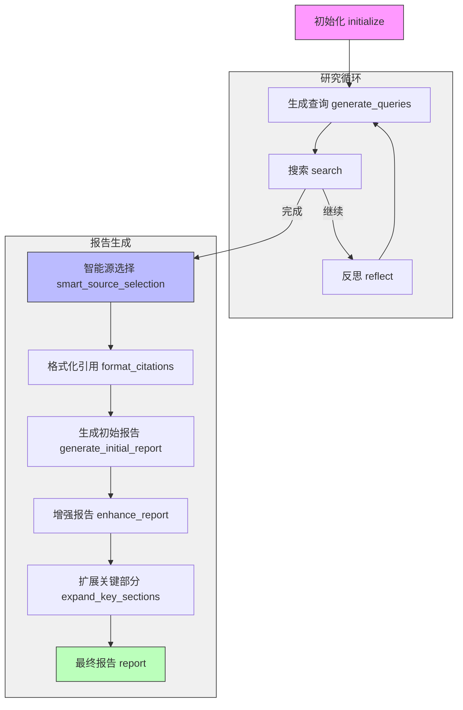

# 研究流程图

## 流程说明

1. **初始化阶段**（紫色）
   - 初始化研究过程
   - 创建研究计划

2. **研究循环**（灰色背景）
   - 生成查询
   - 执行搜索
   - 根据条件判断：
     - 继续：进入反思节点，然后重新生成查询
     - 完成：进入报告生成阶段

3. **报告生成阶段**（灰色背景）
   - 智能源选择（蓝色）
   - 格式化引用
   - 生成初始报告
   - 增强报告
   - 扩展关键部分
   - 最终报告（绿色）

每个节点都是异步执行的，并且都有自己的状态管理和进度回调机制。整个流程设计成一个有机的整体，确保研究的完整性和深度。